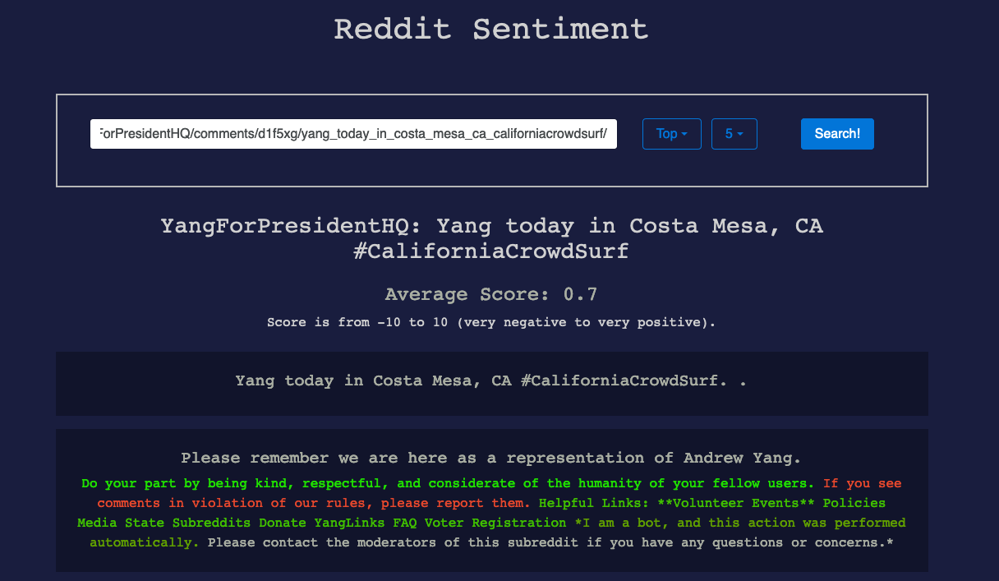
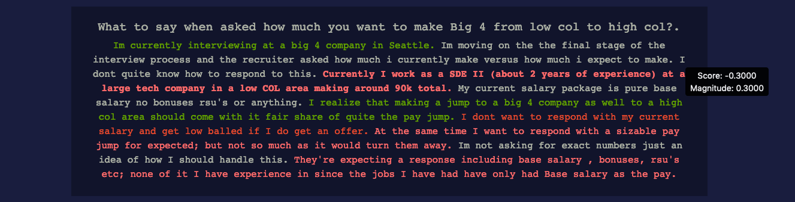

This project was generated with [Angular CLI](https://github.com/angular/angular-cli) version 8.2.0.

# Reddit-Sentiment

Access the app at: http://www.redditsentiment.com/

This webapp allows you to choose any subreddit and see the overall sentiment for the posts on that subreddit. This is a fullstack application created with Angular frontend and Django backend. Google Cloud API is used for analysis and Reddit API is used to get texts to analyze. 

The webapp is containerized with Docker-Compose and deployed to an AWS EC2 free-tier instance via Docker Hub. It also uses nginx to serve static files and gunicorn as an application server. 

## Screenshots

 

  

Shows sentiment data for each sentence.

Still in development.